# anhr-connect
HR Connect dibuat yang bertujuan untuk pendataan karyawan masuk dan keluar. Candidate bisa langsung apply hingga track apply. HRD dapat dengan mudah manage proses recruitment dari proses screening hingga on boarding.

## Stack

    
    
    
    
    

## ERD
- On Progress

## Flowchart
### Employee IN

Penjelasan:
<ul>
    <li>HRD membuka lowongan dan mempostingnya.</li>
    <li>Kandidat melihat daftar lowongan pekerjaan yang tersedia.</li>
    <li>Kandidat mengajukan lamaran (mengisi formulir, upload CV, dll).</li>
    <li>Kandidat dapat memantau status lamarannya.</li>
    <li>HRD mengecek kelengkapan dan kesesuaian CV kandidat dengan persyaratan lowongan.</li>
    <li>HRD melakukan evaluasi lebih mendalam terhadap CV (pengalaman, pendidikan, skill, dll).</li>
    <li>HRD wajib mengirimkan link gform/gmeet/zoom ketika proses interview hrd/user/psikotest/technical test.</li>
    <li>Sebelum on boarding, HRD harus melakukan upload hasil MCU.</li>
</ul>

### Employee OUT

Penjelasan:
<ul>
    <li>Employee melakukan upload pengajuan resign dalam bentuk pdf.</li>
    <li>HRD melakukan approval dan otomatis employee akan masuk tahap one month notice (notice period).</li>
    <li>Paklaring dapat di download bila sudah diatas masa notice period.</li>
</ul>

## Role
1. Admin
2. HRD
3. Candidate (Tanpa Login)

## Account
### Admin
- Email: lamens@domain.test
- Password: test1234

### HRD
- Email: maguire@domain.test
- Password: test1234
- Email: shaw@domain.test
- Password: test1234
- Email: sesko@domain.test
- Password: test1234

## Config
- `composer install`
- `cp .env.example .env`
- `php artisan key:generate`
- `php artisan migrate`
- `php artisan db:seed`
- `wsl`
- `sudo service redis-server start`

## Plugin / Libraries
- Sweetalert 2
- Predis

## Feature
- Manage User
- Manage Medical Company
- Job Posting
- Apply
- Track Apply
- Screening CV
- Interview HRD
- Interview User
- Psikotest
- Technical Test
- MCU
- On Boarding
- Upload Permohonan Resign
- Approval Resign
- Notice Period
- Download Paklaring

## Note
- Status Candidate: 
    - applied 
    - screening 
    - interview_hrd
    - interview_user 
    - psikotest
    - technical_test 
    - mcu
    - on_boarding 
    - hired
    - rejected

## Screenshot Aplikasi
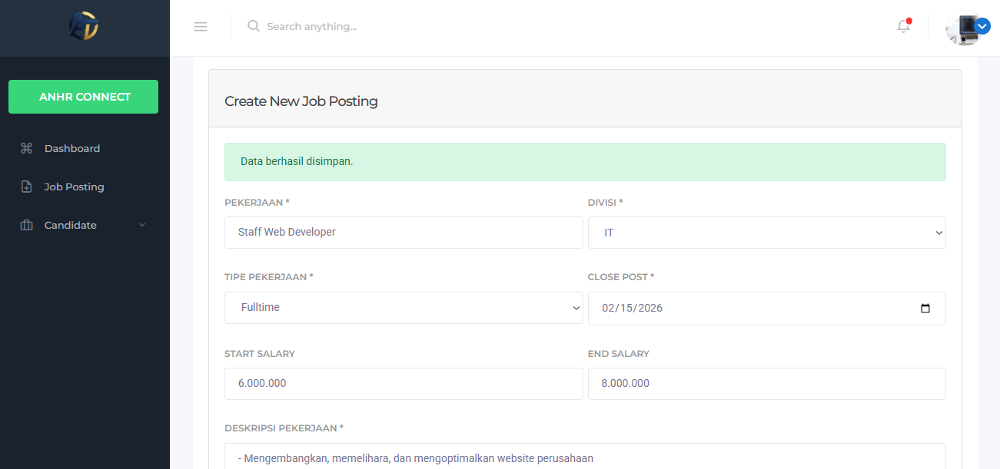
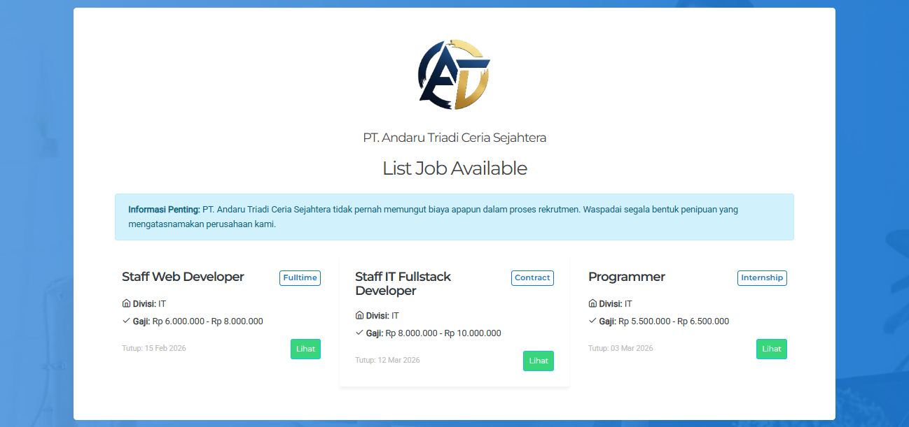
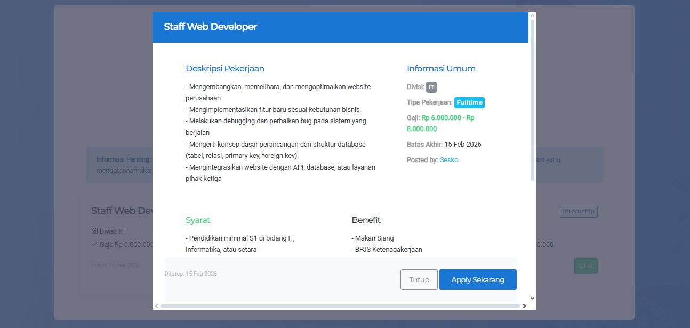
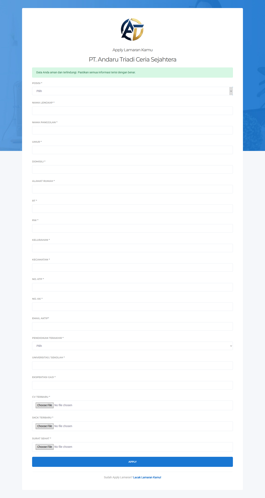
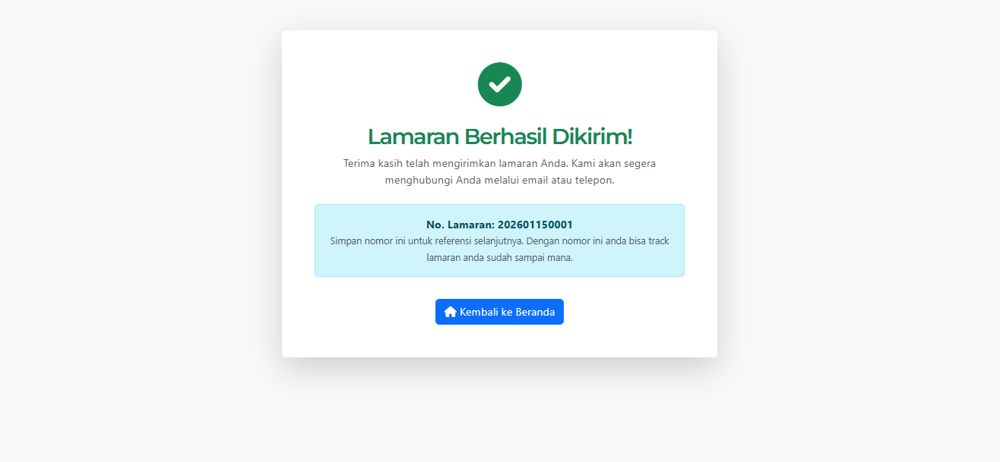
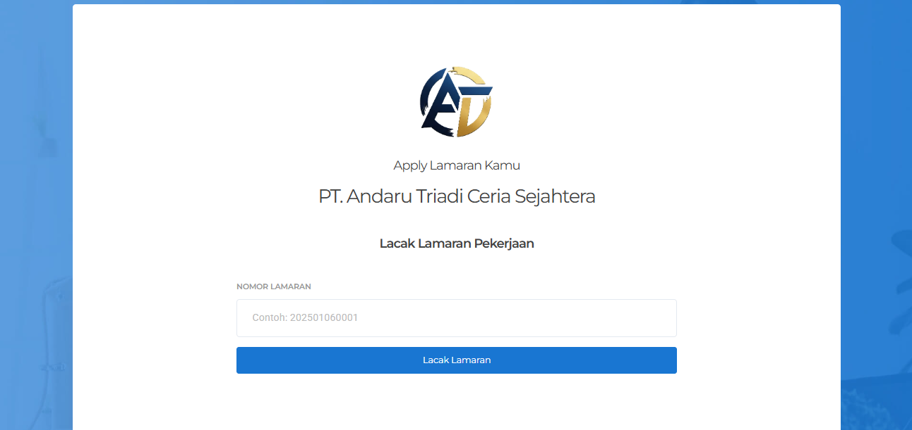
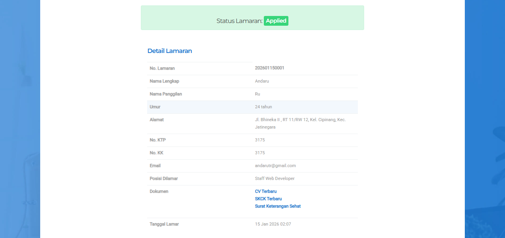
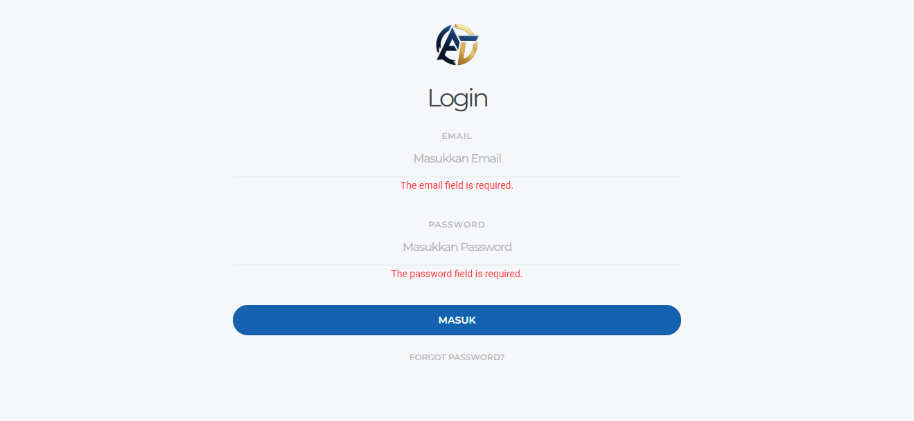
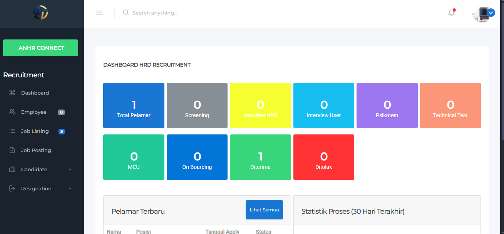
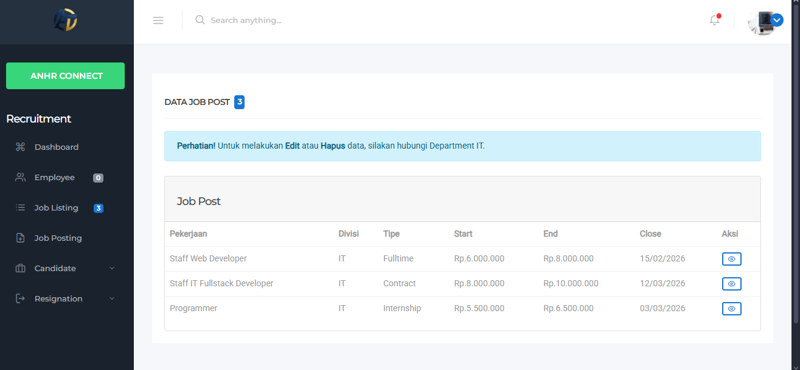
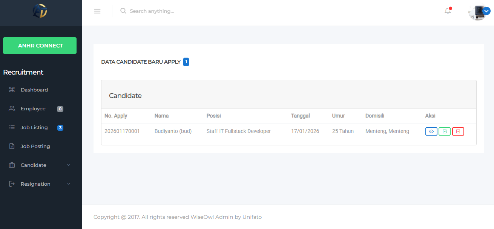
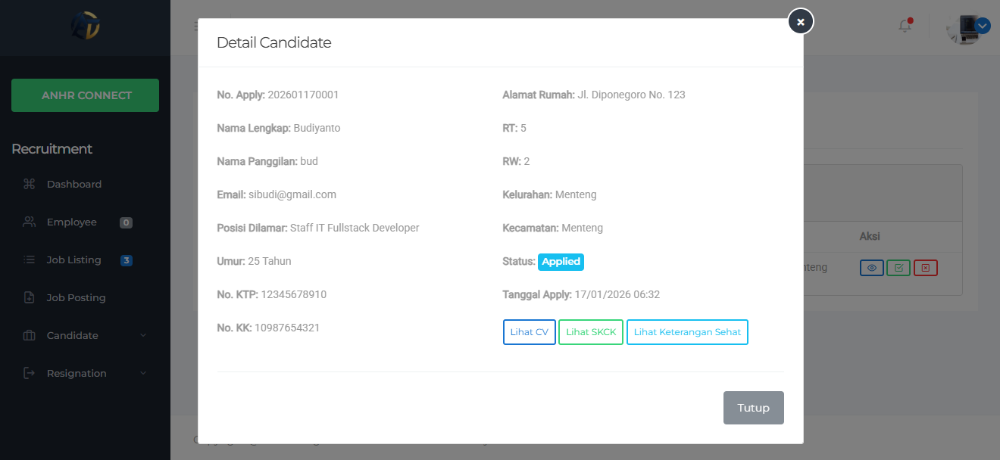
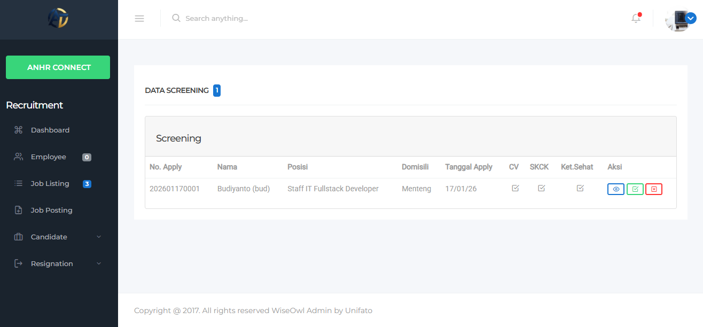